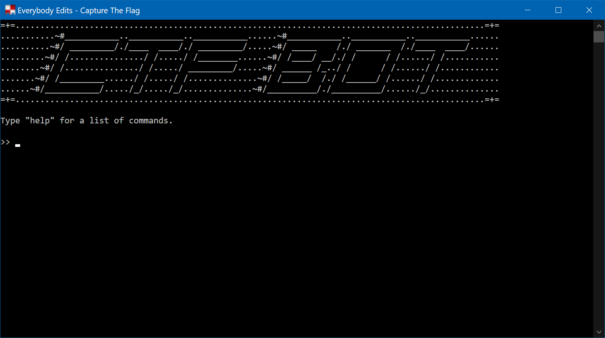
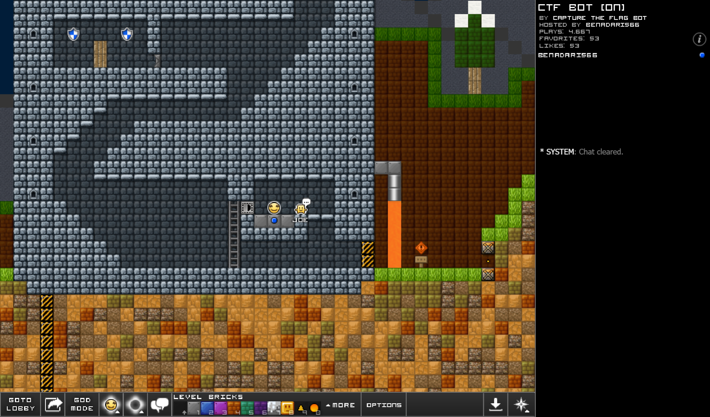
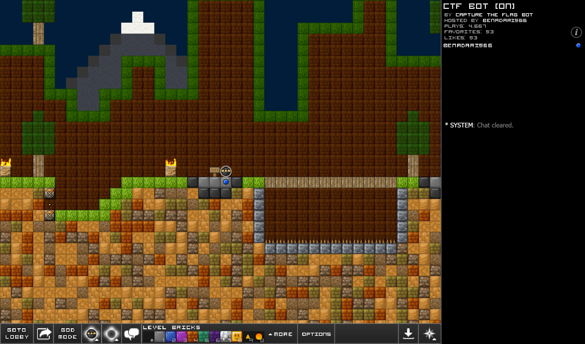
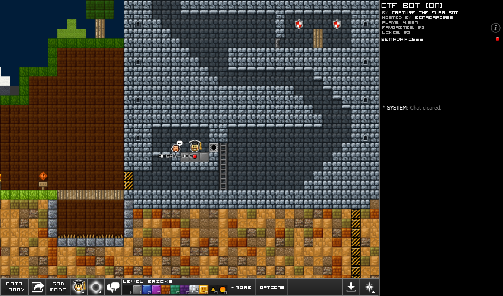
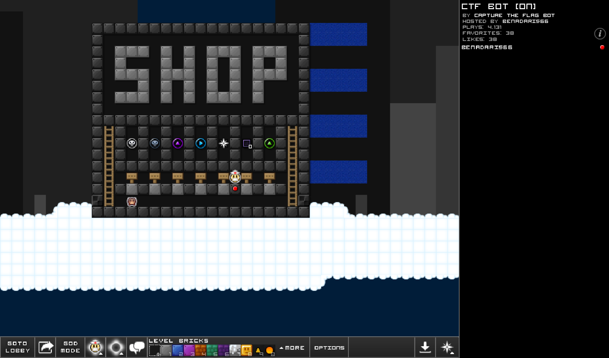
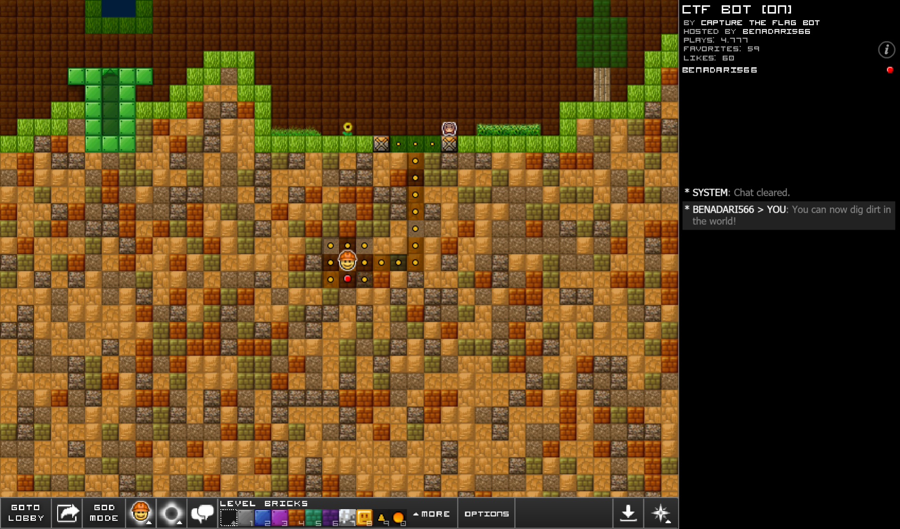

# Everybody-Edits-CTF
This repository contains the source code files for a Capture The Flag bot made for the flash game Everybody Edits.

This bot was originally written in 2015, however, due to the Everybody Edits protocol changes the old bot stopped working. This is a complete rewrite of the entire Capture The Flag bot.

## Current Features
* Ability for an Everybody Edits players to:
    * Attack and kill players of the opposite team.
    * Execute commands.
    * Heal teammates.
    * Take, drop, and capture an enemy flag.
* Anti-cheat system.
* Auto balance system.
* Auto reconnect when bot disconnects for unknown reason.
* Ban system.
* Daily bonus system.
* Dig system.
* Player data (coins, total wins, total losses, etc.), excluding guest accounts, is saved through a MySql database.
* Respawn cooldown when a player dies.
* Room entrance/warp pipe system.
* Shop where players can spend coins on items.
* Traps that can be triggered by players.

## Bot Commands

These commands can only be executed when the bot is connected to an Everybody Edits world. Commands must start with a specific prefix. The prefixes are: `.`, `>`, `!`, and `#`.

### Administrator:
| Command | Parameter(s) | Description |
| - | - | - |
| `ban` | `username` | Bans the player with the specified username from the Everybody Edits world. When a player is banned, they are auto kicked every time they try to join the Everybody Edits world. The MySql database must be loaded in order for this command to work. |
| `disconnect` | | Disconnects the bot from the Everybody Edits world. |
| `kick` | `username` `reason`  | Kicks the specified user from the Everybody Edits world. |
| `retf` | `team_colour` | Returns a team's flag to their base. The team's flag must be taken by a player for this command to work. Moreover, the first parameter must be either `blue` or `red`. Any other value will not be accepted. |
| `unban` | `username` | Unbans the player with the specified username from the Everybody Edits world. The MySql database must be loaded in order for this command to work. |

### Regular:
| Command | Parameter(s) | Description |
| - | - | - |
| `amiadmin` | | Sends the user saying the command a private message stating whether they are an administrator or not. |
| `coins` | | Sends the user saying the command a private message stating how many coins. |
| `donatecoins` | `username`          | Donates coins to another user. |
| `help` | | Sends the user saying the command a private message on how to use the bot. |
| `spectate` | | Toggles the spectate mode status of the player. If a player has spectate mode on, they can fly around in the Everybody Edits world. If they have it off, they can't fly around in the Everybody Edits world.|
| `totalwins` or `wins` | | Sends the user saying the command a private message stating the total Capture The Flag games they won. |
| `totallosses` or `losses` | | Sends the user saying the command a private message stating the total Capture The Flag games they lost. |
| `totalkills` | | Sends the user saying the command a private message stating the total amount of players they've killed. |

### Game:
| Command | Parameter(s) | Description |
| - | - | - |
| `blueflag` | | Sends a chat message saying the username of the player holding the blue flag. |
| `redflag` | | Sends a chat message saying the username of the player holding the red flag. |
| `dropflag` | | If the player saying the command has the flag, the flag is dropped on the ground wherever their last horizontal location was. |
| `gamefund` | | Sends a chat message saying the amount of coins raised for the current Capture The Flag game round. |
| `heal` | | Heals a players health to 100%. This command only works if the player is located in their home base. |
| `health` or `hp` | | Sends the user saying the command a private message which states the amount of health points (HP) the player currently has. |
| `lobby` or `quit` | | Sends the user saying the command to the game lobby, removing them from the current Capture The Flag game round. |
| `maxflags` | | Sends a chat message stating the maximum number of flags a team must capture in order to win the game. |
| `scores` | | Sends a chat message stating the number of flags both the blue and red team captured. |
| `suicide` | | Kills the player saying the command which results in them respawning. |

## Frequently Asked Questions

### What version of .NET Framework is required in order to run this program?
You need .NET Framework v4.7.2 in order to run this program.

### What software did you use to run the database? 
I used [XAMPP](https://www.apachefriends.org/index.html) to run a MySql database locally on my machine.

### Is data stored securely through this program?
No.

### Does this bot work with [Everybody Edits Offline](https://github.com/Seb-135/ee-offline)?
No, this bot does not work with Everybody Edits Offline because Everybody Edits Offline does not use the PlayerIO API. PlayerIO is required for this bot to work.

## Screenshots

## Video Showcase
Click [here](https://www.youtube.com/watch?v=n2VMRJCXPEw) to watch a YouTube video of the bot in action.
